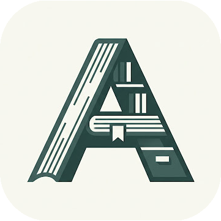
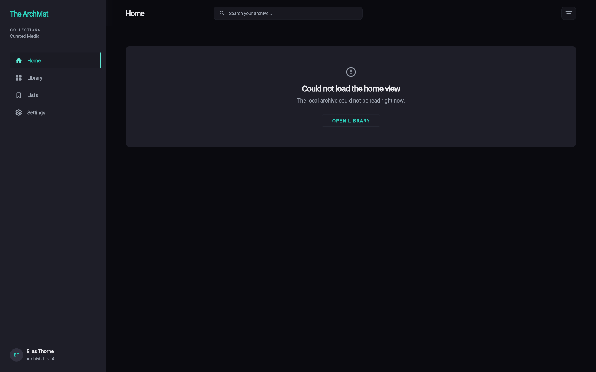

<p align="center">
  
</p>

<h1 align="center">The Archivist</h1>

<p align="center">
  A Windows-first personal media tracker built with Flutter.
</p>

<p align="center">
  Track what you watch, read, and play. Organize your media into curated collections. Sync with <a href="https://bgm.tv">Bangumi</a> to keep your progress up to date.
</p>

---

## Preview



---

## Features

| Feature | Description |
|---------|-------------|
| **Library** | Browse your entire media collection in a responsive poster grid. Supports movies, TV shows, books, and games. |
| **Lists** | Create custom collections to organize titles. Each list displays a 2x2 poster mosaic for instant visual recognition. |
| **Detail View** | Rich media detail page with metadata, progress tracking, and Bangumi sync status. |
| **Bangumi Integration** | Connect your Bangumi account to sync watch progress and fetch metadata. |
| **Cloud Sync** | Backup and sync your library across devices via S3-compatible storage. |
| **Dark Theme** | Carefully crafted dark UI with mint accent (#5EEAD4) for comfortable long sessions. |

---

## Tech Stack

| Layer | Technology |
|-------|------------|
| Framework | [Flutter](https://flutter.dev) 3.10+ |
| State Management | [Riverpod](https://riverpod.dev) |
| Routing | [Go Router](https://pub.dev/packages/go_router) |
| Local Database | [Drift](https://drift.simonbinder.eu) (SQLite) |
| HTTP Client | [Dio](https://pub.dev/packages/dio) |
| Cloud Sync | AWS Signature V4 (S3-compatible) |
| External API | [Bangumi Open API](https://github.com/bangumi/api) |

---

## Platform Support

| Platform | Status |
|----------|--------|
| Windows | Primary target |
| Android | Supported |
| macOS | Planned |
| Linux | Planned |
| iOS | Planned |

---

## Getting Started

### Prerequisites

- [Flutter SDK](https://docs.flutter.dev/get-started/install) 3.10 or later
- Dart 3.0+

### Run

```bash
# Clone the repository
git clone <repo-url>
cd record_anywhere

# Install dependencies
flutter pub get

# Generate drift database code
flutter pub run build_runner build

# Run on Windows
flutter run -d windows
```

### Build

```bash
# Windows
flutter build windows

# Android (64-bit)
flutter build apk --target-platform=android-arm64
```

---

## Project Structure

```
lib/
├── app/                    # App bootstrap, router, shell scaffold
├── features/               # Feature modules
│   ├── add/               # Add new media
│   ├── bangumi/           # Bangumi API integration
│   ├── detail/            # Media detail page
│   ├── home/              # Home dashboard
│   ├── library/           # Media library grid
│   ├── lists/             # Custom lists & collections
│   ├── settings/          # App settings
│   └── sync/              # Cloud sync logic
├── shared/                # Shared code
│   ├── data/              # Database, DAOs, repositories
│   ├── theme/             # App theme & design tokens
│   └── widgets/           # Reusable UI components
└── main.dart              # Entry point
```

---

## Architecture

The app follows a **layered feature-first architecture**:

- **Presentation Layer**: Flutter widgets + Riverpod providers for UI state
- **Domain/Controller Layer**: Controllers orchestrate use cases and expose state to UI
- **Data Layer**: Repositories abstract DAOs; DAOs use Drift for type-safe SQLite access
- **External Layer**: HTTP services (Dio), file pickers, and platform APIs

---

## License

[MIT](LICENSE)

---

> Built with Flutter. Designed for media lovers.
